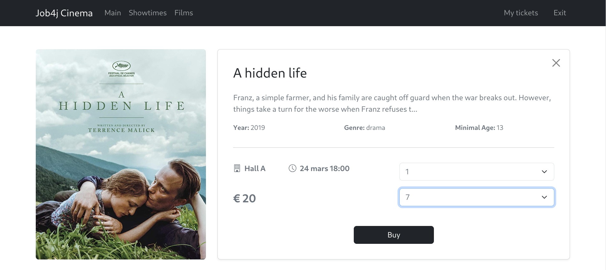

# job4j_cinema

## 🎥 Project Description

**job4j_cinema** is a web application for purchasing cinema tickets.  
It allows users to:

- Register and log in
- View the schedule of film sessions
- Learn about movies
- Purchase tickets for a selected session

The project is implemented using:

- Spring Boot
- Thymeleaf
- Bootstrap
- Liquibase
- Sql2o
- PostgreSQL

---

## 🛠️ Requirements

To run the project, make sure the following are installed:

- **Java 17**
- **Maven 3.8+**
- **PostgreSQL 14**

---

## 🚀 Running the Project

### 1. Clone the repository

```bash
git clone https://github.com/Krasobas/job4j_cinema.git
```

### 2. Navigate to the project directory

```bash
cd job4j_cinema
```

### 3. Create the database manually

```sql
create database cinema;
```

> ⚠️ Liquibase will automatically create the necessary tables and load the data (if the database is created correctly).

### 4. Run the project

```bash
mvn spring-boot:run
```

### 5. Open the application in your browser

```text
http://localhost:8080
```

## 📸 Interaction with the Application

The application has a web interface. Below are some of the main pages:

- **Main Page**
- **Registration Page (Sign in)**
- **Authentication Page (Login in)**
- **Showtimes Page**
- **Movies Page**
- **Movie Description Page**
- **User's Tickets Page**
- **Ticket Purchase Page**

## 🖼️ Screenshots

### Main Page


### Registration Page


### Authentication Page


### Authentication Error Page


### Showtimes Page


### Movies Page


### Movie Description Page


### User's Tickets Page


### Ticket Purchase Page



## 📧 Contact

Email: vasiliy.krasov.job@gmail.com

Telegram: @krasobas